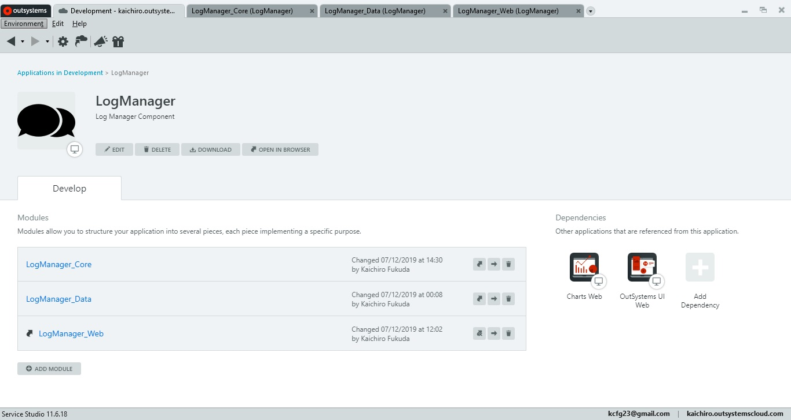
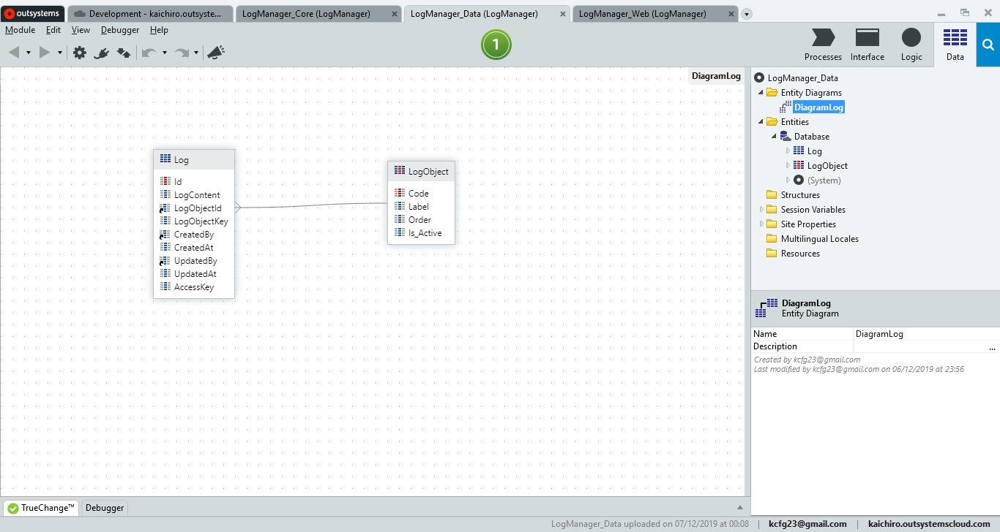
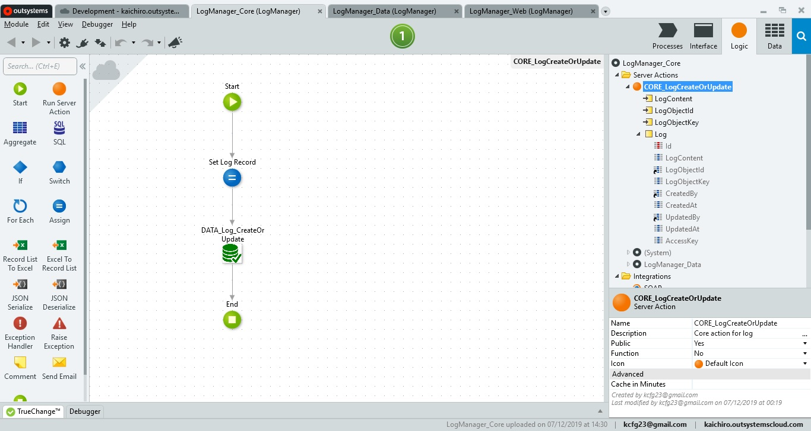
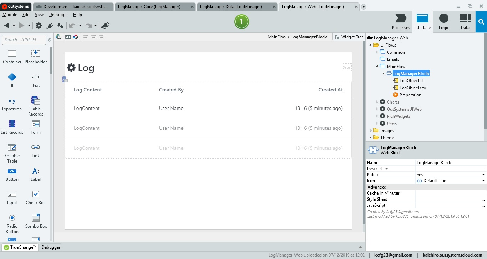

#LogManager

Application that records configurable transactions / logs.
This application may be incorporated into any other OutSystems application for the purpose of tracking system usage flow related activities.

---

###### Project

###### Data Data

###### Core module

###### Web module

